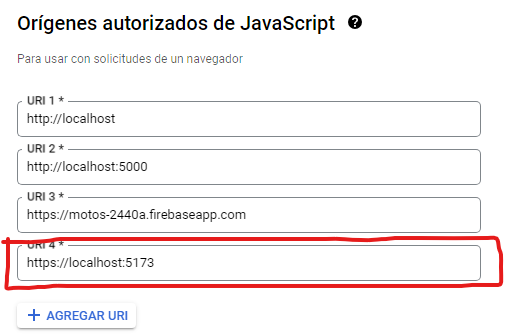
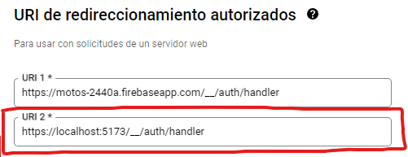
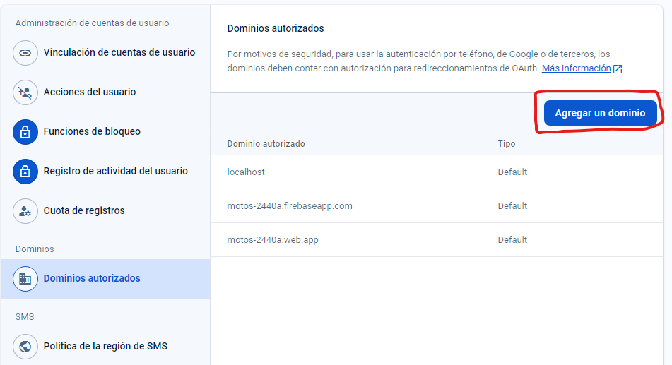

### Run project
`bun run dev`

### Firebase configuration in: `/src/config/firebase.ts`

```jsx
const firebaseConfig = {
    ...
    authDomain: "localhost:5173",
    ...
  };
```

### Firebase configuration in: `/vite.config.ts`

Install: `bun add @vitejs/plugin-basic-ssl -D`

```ts
import basicSsl from '@vitejs/plugin-basic-ssl'

export default defineConfig({
  plugins: [react(), basicSsl()],
  server: {
    https: true,
    proxy: {
      '/__/auth': {
        target: 'https://<my-project>.firebaseapp.com',
        changeOrigin: true,
        secure: true,
        rewrite: (path) => path.replace(/^\/__\/auth/, '/__/auth'),
      },
    },
  },
});

```

### Config in Google Cloud

Add in `ID de clientes OAuth 2.0` your API KEY:





### Note

If you want to add your domain in production you must change localhost:5173 for your domain and add it in Firebase `Authentication > Configuration > Authorized Domains`

